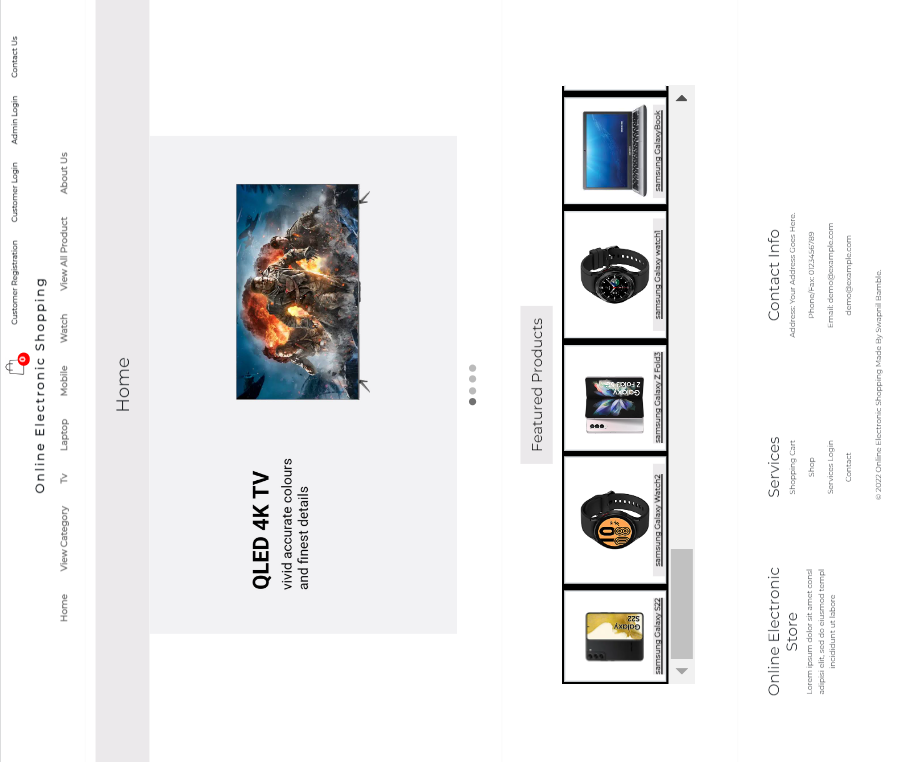
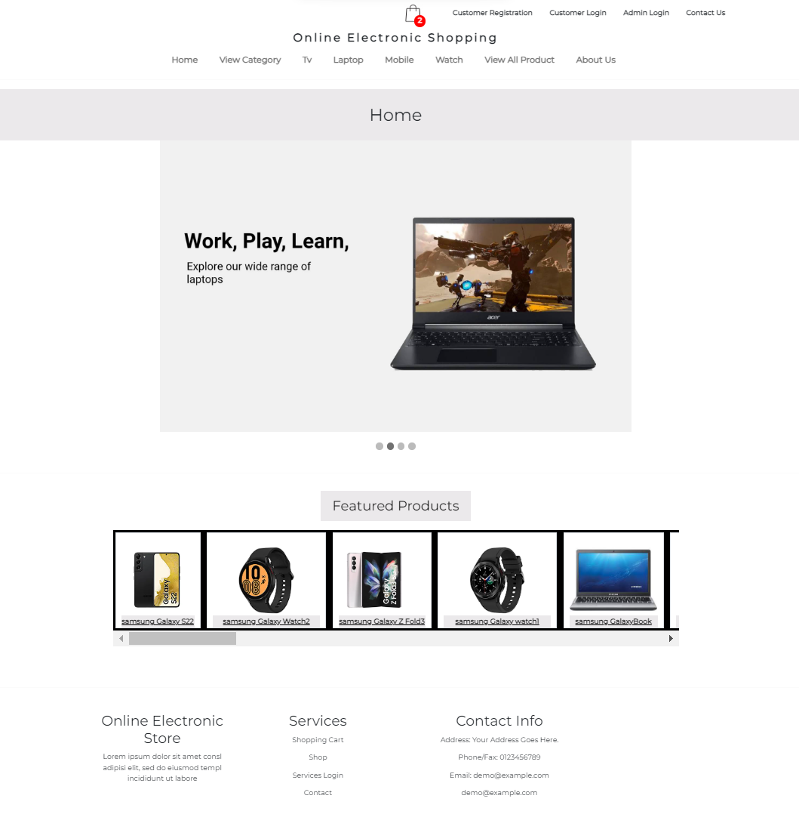
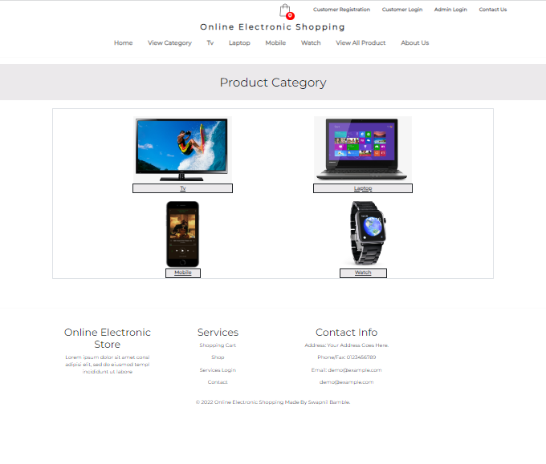
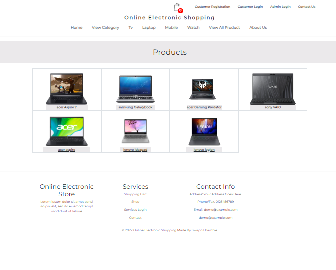
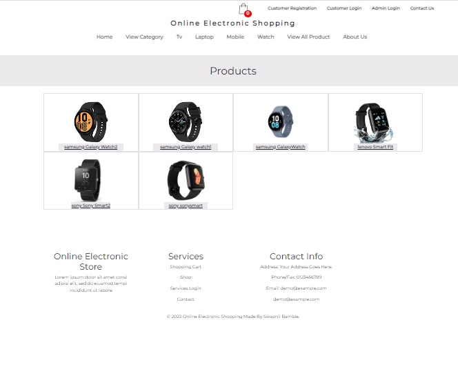
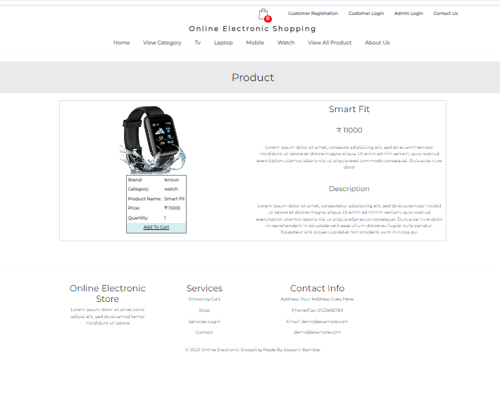
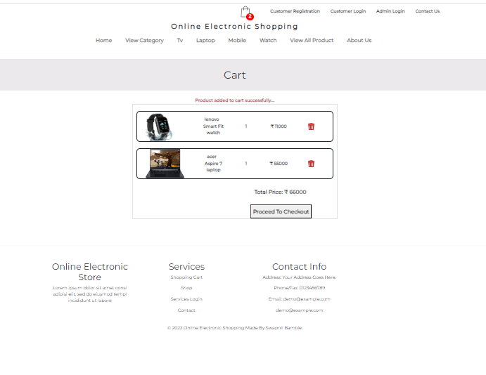
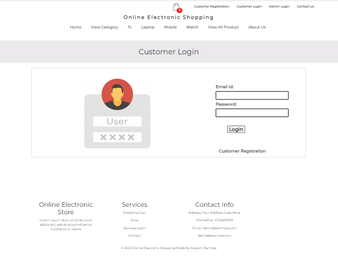
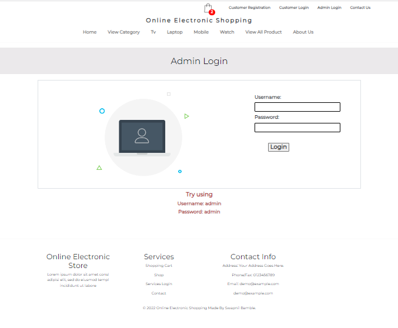

# Ecommerce Application - Java J2EE

### Take a look at this Application
url: https://swapnilbamble1438.github.io/EcommerceApplication/

### It is Java J2EE Application. Build in Eclipse IDE using Maven.
## It is an Online Electronic Shopping Application. 

### Application Features:
- It shows the working example of how Online Shopping Websites works.
-   Where User can add product to cart, user can register,login,logout or buy product. and Admin can Add new Products to items list and can manage the Customers.

### Technology used in this Project: 
- i) Java: all Backend logic has been written in java.
- ii) HTML,CSS and Bootstrap: designing page layout.
- iii) JSP & Javascript: all the front end logic has been written in jsp and javascript. 
- iv) SQLite: SQLite database has been used as database. 
- v) Tomcat: project will be run over the tomcat server.
- vi) Maven: Maven is used for getting required jar files.

### Software And Tools Required:
- Java JDK 8+
- Eclipse EE
- Apache Maven
- Tomcat v8.0+
- SQLite Tools (Online or Offline Tool)

### Steps To Import And Run The Project in Eclipse EE
- In Eclipse
- Click on File
- Select Import
- Select Projects from Git(with smart import) -> Next
- Select Clone URI -> Next
- In URI paste this url: https://github.com/swapnilbamble1438/EcommerceApp.git
  -> Next
-  Now in Local Destination

-  proceed -> Next

- select -> Search for nested projects
- and select -> Detect and configure project natures options

            Now only select EcommerceApp\EcommerceApp
            -> Finish
  
-  If everything goes right Project will get successfully imported
-  Now wait for few seconds for getting things properly loaded
-  Now open Project > open com.conn package > open DBConnect.java file.
   Now make some changes in this file,
   change Database file location/(mydatabase.db) file location/
   change "conn" value,
   like if it is:
   
   conn = DriverManager.getConnection("jdbc:sqlite:C:/Users/Swapnil/eclipse- 
   workspace/Online Electronic Shopping/mydatabase.db");
   
   change the "conn" value/path according to your mydatabase.db file location.

                 mydatabase.db file will get just inside Project folder only,
                 Open Project folder you will get mydatabase.db file present.
   
-  After doing changes save the DBConnect.java file.   
-  Right Click On Project > Run As > Run On Server > Select Tomcat V8.0+ > Next > Finish
-  Now Website will get open, if not, then try opening it manually in Browser,
   Type Url: http://localhost:8082/EcommerceApp
-  Note: In Url put Port according to your server.
  

### Some Screenshots of this Project:

==================================================================================================================================================================

==================================================================================================================================================================

==================================================================================================================================================================

==================================================================================================================================================================

==================================================================================================================================================================

==================================================================================================================================================================

==================================================================================================================================================================

==================================================================================================================================================================

==================================================================================================================================================================

==================================================================================================================================================================

### You can also use MySQL as Database

- Create or Select a Database
- Use that Database
- Insert this queries:

- CREATE TABLE brand (
  bid int DEFAULT NULL,
  bname varchar(50) DEFAULT NULL
); 

- INSERT INTO brand VALUES (1,'samsung'),(2,'sony'),(3,'lenovo'),(4,'acer'),(5,'onida');

- CREATE TABLE cart (
  Name varchar(100) DEFAULT NULL,
  bname varchar(50) DEFAULT NULL,
  cname varchar(50) DEFAULT NULL,
  pname varchar(50) DEFAULT NULL,
  pprice int DEFAULT NULL,
  pquantity int DEFAULT NULL,
  pimage varchar(200) DEFAULT NULL
);

- CREATE TABLE category (
  cid int DEFAULT NULL,
  cname varchar(50) DEFAULT NULL
);

- INSERT INTO category VALUES (1,'laptop'),(2,'tv'),(3,'mobile'),(4,'watch');

- CREATE TABLE contactus (
  id int NOT NULL AUTO_INCREMENT,
  Name varchar(100) DEFAULT NULL,
  Email_Id varchar(100) DEFAULT NULL,
  Contact_No int DEFAULT NULL,
  Message varchar(8000) DEFAULT NULL,
  PRIMARY KEY (id)
);

- CREATE TABLE customer (
  Name varchar(100) DEFAULT NULL,
  Password varchar(20) DEFAULT NULL,
  Email_Id varchar(100) DEFAULT NULL,
  Contact_No int DEFAULT NULL
);

- CREATE TABLE login (
  username varchar(100) DEFAULT NULL,
  password varchar(100) DEFAULT NULL
);

- INSERT INTO login VALUES ('admin','admin');

- CREATE TABLE order_details (
  Date varchar(100) DEFAULT NULL,
  Name varchar(100) DEFAULT NULL,
  bname varchar(50) DEFAULT NULL,
  cname varchar(50) DEFAULT NULL,
  pname varchar(50) DEFAULT NULL,
  pprice int DEFAULT NULL,
  pquantity int DEFAULT NULL,
  pimage varchar(200) DEFAULT NULL
);

- CREATE TABLE orders (
  Order_Id int NOT NULL AUTO_INCREMENT,
  Customer_Name varchar(100) DEFAULT NULL,
  Customer_City varchar(45) DEFAULT NULL,
  Date varchar(100) DEFAULT NULL,
  Total_Price int DEFAULT NULL,
  Status varchar(45) DEFAULT NULL,
  PRIMARY KEY (Order_Id)
);

- CREATE TABLE product (
  pid int NOT NULL AUTO_INCREMENT,
  pname varchar(50) DEFAULT NULL,
  pprice int DEFAULT NULL,
  pquantity int DEFAULT NULL,
  pimage varchar(200) DEFAULT NULL,
  bid int DEFAULT NULL,
  cid int DEFAULT NULL,
  PRIMARY KEY (pid)
);

- INSERT INTO product VALUES (5,'sonysmart',50000,1,'sonywatch.webp',2,4),(6,'GalaxyBook',45000,1,'samsunglaptop.jpg',1,1),(7,'smarttv',28000,1,'onidatv.jpg',5,2),(8,'smartphone',15000,1,'lenovomobile.webp',3,3),(9,'aspire',52000,1,'acerlaptop.jpg',4,1),(10,'Braviass',52,1,'sonytv.jpg',2,2),(11,'GalaxyWatch',22000,1,'galaxywatch.webp',1,4),(14,'kdl',45000,1,'sony kdl.jpg',2,2),(15,'series a7',21000,1,'acer series a7.jpg',4,2),(17,'leo',31000,1,'onida leo.jpg',5,2),(18,'crystal',42000,1,'samsung crystal.webp',1,2),(19,'Aspire 7',55000,1,'acer aspire7.jpg',4,1),(20,'ideapad',37000,1,'lenovo ideapad.jpg',3,1),(21,'legion',51000,1,'lenovo legion.jpg',3,1),(22,'Galaxy Z Fold3',66000,1,'Galaxy z fold3.jpg',1,3),(23,'Galaxy S22',55000,1,'Samsung galaxy s22.webp',1,3),(24,'Xperia 1v',56000,1,'sony xperia 1v.jpg',2,3),(26,'A850',14500,1,'lenovo a850.jpg',3,3),(27,'Galaxy watch1',8000,1,'galaxy watch.jpg',1,4),(28,'Galaxy Watch2',95000,1,'galaxy watch4.jpg',1,4),(29,'Smart Fit',11000,1,'smart fit.jpg',3,4),(30,'Sony Smart2',12000,1,'sony smart2.webp',2,4),(31,'Gaming Predator',120000,1,'Acer Predator.jpg',4,1),(32,'Liquid',16000,1,'Acer liquid.jpg',4,3),(33,'Neo QLED',46000,1,'Samsung neo Qled.webp',1,2),(34,'VAIO',53000,1,'Sony Vaio.jpg',2,1),(35,'Xperia Z',32000,1,'sonyxperiaz.png',2,3);

- CREATE VIEW `viewlist` AS select `brand`.`bname` AS `bname`,`category`.`cname` AS `cname`,`product`.`pname` AS `pname`,`product`.`pprice` AS `pprice`,`product`.`pquantity` AS `pquantity`,`product`.`pimage` AS `pimage` from ((`brand` join `product` on((`brand`.`bid` = `product`.`bid`))) join `category` on((`product`.`cid` = `category`.`cid`))) ;

- CREATE VIEW `mobile` AS select `brand`.`bname` AS `bname`,`category`.`cname` AS `cname`,`product`.`pname` AS `pname`,`product`.`pprice` AS `pprice`,`product`.`pquantity` AS `pquantity`,`product`.`pimage` AS `pimage` from ((`brand` join `product` on((`brand`.`bid` = `product`.`bid`))) join `category` on((`product`.`cid` = `category`.`cid`))) where (`category`.`cid` = 3) ;

- CREATE VIEW `laptop` AS select `brand`.`bname` AS `bname`,`category`.`cname` AS `cname`,`product`.`pname` AS `pname`,`product`.`pprice` AS `pprice`,`product`.`pquantity` AS `pquantity`,`product`.`pimage` AS `pimage` from ((`brand` join `product` on((`brand`.`bid` = `product`.`bid`))) join `category` on((`product`.`cid` = `category`.`cid`))) where (`category`.`cid` = 1) ;

- CREATE VIEW `tv` AS select `brand`.`bname` AS `bname`,`category`.`cname` AS `cname`,`product`.`pname` AS `pname`,`product`.`pprice` AS `pprice`,`product`.`pquantity` AS `pquantity`,`product`.`pimage` AS `pimage` from ((`brand` join `product` on((`brand`.`bid` = `product`.`bid`))) join `category` on((`product`.`cid` = `category`.`cid`))) where (`category`.`cid` = 2) ;

- CREATE VIEW `watch` AS select `brand`.`bname` AS `bname`,`category`.`cname` AS `cname`,`product`.`pname` AS `pname`,`product`.`pprice` AS `pprice`,`product`.`pquantity` AS `pquantity`,`product`.`pimage` AS `pimage` from ((`brand` join `product` on((`brand`.`bid` = `product`.`bid`))) join `category` on((`product`.`cid` = `category`.`cid`))) where (`category`.`cid` = 4) ;

- CREATE TABLE usermaster (
  Name varchar(100) DEFAULT NULL,
  Password varchar(20) DEFAULT NULL
);

- INSERT INTO usermaster VALUES ('admin','admin');

### Now do some changes in Project
- In Eclipse
- Open Project > open com.conn package > open DBConnect.java file.
   Now make some changes in this file,
   change "conn" value,
  like if it is
   
   conn = DriverManager.getConnection("jdbc:sqlite:C:/Users/Swapnil/eclipse- 
   workspace/Online Electronic Shopping/mydatabase.db");
   
   change it to

  conn = DriverManager.getConnection("jdbc:mysql://localhost:3306/DatabaseName","root","root");

  Note: Put Address according to your Database Name and Password.

  - Save the file

  - Now try running Project and Check if the changes are done or not.

   

### Project Creator: Swapnil Bamble

